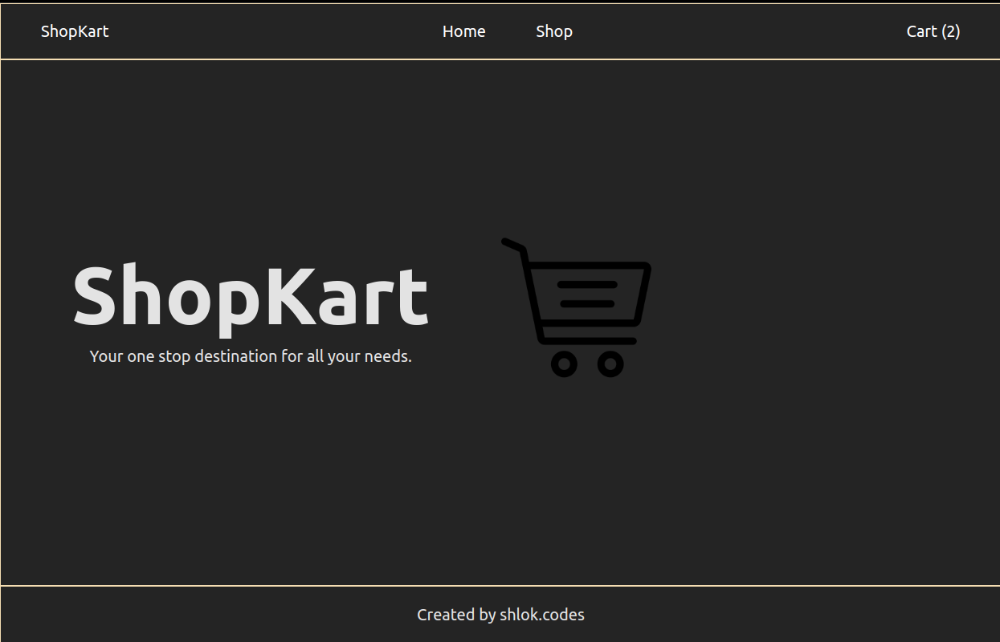
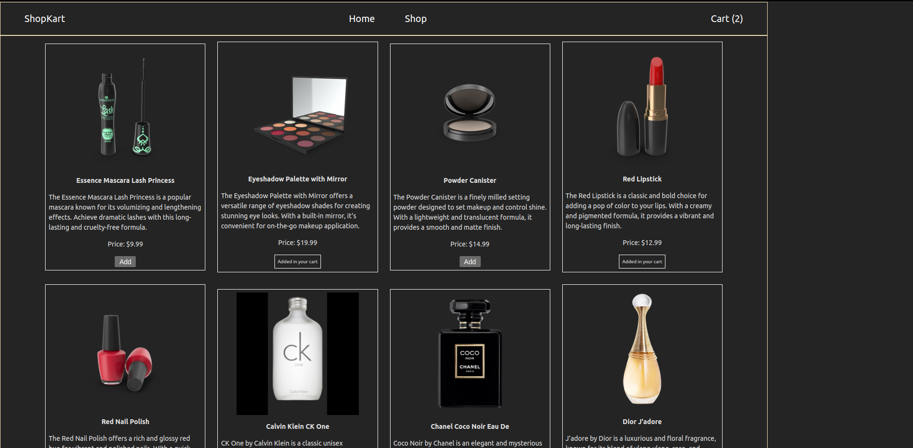
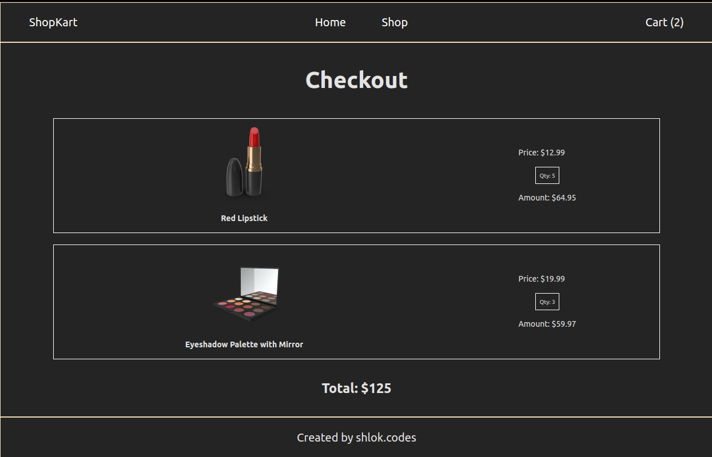

# Shopping Cart

[Live Preview](https://shopping-cart-tau-pearl-49.vercel.app/)

A basic shopping app with fake products to choose from. The application is built with React and has/will have the following functionalities:

1. A catalogue of products the details of which have been fetched from DummyJSON API.
2. Quantities of each product can be set.
3. A cart that stores all the products selected, along with each of their quantites and the total invoice amount.

### Home Page

### Products Page

### Cart Page
